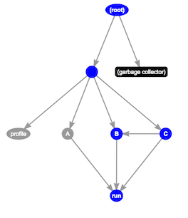

class: center,middle

# JavaScript 性能分析

王龑

.small[OneAPM Node.JS工程师]

[.fa.fa-github.big[]](https://github.com/wyvernnot/stuq_workshop)

---

### JavaScript 最新发展和新技术的结合

### Maker

- 操作智能硬件

- 实现物联网网关

### Docker

- 兼容性测试 .small[ Node.JS 0.8 0.10 0.12 IO.JS 1.x 2.x]


- 环境搭建 .small[ 一星期 => 几分钟 => 秒级 ]


- 应用打包发布 .small[Sinopia，Ghost,DaoCloud]

---
class:middle

#未来 JavaScript 将会有更广泛的应用。

需要解决执行效率，内存占用，监控工具的问题

---

# 课程内容

### 1. CPU Profile 
### 2. Heap Snapshot
### 3. GC

---

# CPU Profile 的常见形式

- ## 插桩 
- ## 采样

---

## 插桩

最早是由J.C. Huang 教授提出的，它是在保证被测程序原有逻辑完整性的基础上在程序中插入一些探针（又称为“探测仪”），
通过探针的执行并抛出程序运行的特征数据，通过对这些数据的分析，可以获得程序的控制流和数据流信息，进而得到逻辑覆盖等动态信息，从而实现测试目的的方法。

**黑客帝国 机器乌贼**

在系统里漫游，上报各种参数。

---

# JavaScript 如何实现插桩

**`alert`函数**

```js
var _original=window.alert;

window.alert=function(){

    console.log('in');

    var result=_original.apply(this,arguments);

    console.log('out');

    return result;

}
```

---

# JavaScript 如何实现插桩

**`setTimeout`函数**

```js
var _original_sett = window.setTimeout;

window.setTimeout = function () {
    console.log('enter');

    var args = [].slice.apply(arguments);
    var _original_callback = args.shift();

    var callback = function () {
        console.log('exit');
        _original_callback.apply(this, arguments);
    }

    args.unshift(callback);

    var result = _original_sett.apply(this, args);
    return result;
}
```

---
class:inverse,middle,center
background-image: url(images/trap.jpg)

需要插桩的模块：

HTTP Server

文件系统

DNS

中间件

...

# 插桩是脏活累活

.right[
 [但是有意(qian)义(zhuan)](http://www.oneapm.com/)
]

---

class:inverse

.left[#采样]
.right[]

---

#可用的 Profilers

- ### Chrome Dev Tools

- ### Node-Inspector

- ### v8-profiler

---

# 代码里开启 CPU Profile

```js

console.profile([NAME]);

// your application

console.profileEnd([NAME]);

```

.small[ console.profile 命令只适用于 Chrome ]

---

#生成 `.cpuprofile` 文件

1.打开用于测试的网页 [01-abc.html](http://wyvernnot.github.io/stuq_workshop/example/01-abc.html):

2.开启 Chrome Dev Tools，刷新页面

3.查看 CPU Profile 的结果:

.img[

]

4.导出`.cpuprofile`文件

---
#理解 `.cpuprofile` 文件

1\. `.cpuprofile` 其实就是一个 JSON 格式的文件，有 `head`, `timestamps`, `samples` 等几个重要的属性

2\. `head` 指向一个结点，对应 v8 类 `CpuProfileNode`，同时它的 `children` 指向子结点, 因此是一个嵌套结构

3\. `CpuProfileNode` 有很多重要的属性，包括 functionName，lineNumber，columnNumber，hitCount 等

4\. `timestamps` 是一个数组，记录着 Profiling 过程中每个采样点的时间戳

5\. 对应 `timestamps` 下的每个时间点，`samples` 数组相同的位置都会有一个数字，对应路径

---

#可视化的 `.cpuprofile`

> [OneProfile](http://wyvernnot.github.io/javascript_performance_measurement/cpuprofile_topology/) 
> 是一个网页版的小工具，可以用全新的方式展示 JavaScript 性能分析的结果，帮助开发者洞悉函数调用关系，优化应用性能。

.center[

.fa.fa-step-backward[] 前一个采样点

.fa.fa-step-forward[] 下一个采样点
]
---
class:center

#原理




在左边的 FlameChart 来上一刀 .del[切糕]

此时采样到的调用栈为 `匿名函数->C->B->run`

于是 `run` 的 `tickCount` 加1

---
class: inverse
background-image: url(images/fractal.jpg)

# Heap Snapshot

---

# Heap 的组成

- 新生区：大多数对象被分配在这里。新生区是一个很小的区域，垃圾回收在这个区域非常频繁，与其他区域相独立。

- 老生指针区：这里包含大多数可能存在指向其他对象的指针的对象。大多数在新生区存活一段时间之后的对象都会被挪到这里。

- 老生数据区：这里存放只包含原始数据的对象（这些对象没有指向其他对象的指针）。字符串、封箱的数字以及未封箱的双精度数字数组，在新生区存活一段时间后会被移动到这里。

- 大对象区：这里存放体积超越其他区大小的对象。每个对象有自己mmap产生的内存。垃圾回收器从不移动大对象。

- 代码区：代码对象，也就是包含JIT之后指令的对象，会被分配到这里。这是唯一拥有执行权限的内存区（不过如果代码对象因过大而放在大对象区，则该大对象所对应的内存也是可执行的。译注：但是大对象内存区本身不是可执行的内存区）。

- Cell区、属性Cell区、Map区：这些区域存放Cell、属性Cell和Map，每个区域因为都是存放相同大小的元素，因此内存结构很简单。

.right[
*[V8 之旅： 垃圾回收器](http://newhtml.net/v8-garbage-collection/)
]

---

# 如何生成 Heap Snapshot

- ### Chrome Dev Tools

- ### Node.JS

[https://github.com/bnoordhuis/node-heapdump](https://github.com/bnoordhuis/node-heapdump)

```sh
npm install heapdump
```

```js
var heapdump = require('heapdump');

heapdump.writeSnapshot(function(err, filename) {
  console.log('dump written to', filename);
});
```


---

#理解 `.heapsnapshot` 文件格式

1\. `snapshot` 属性保存了关于快照的一些基本信息，如 uid，快照名，节点个数等

2\. `nodes` 保存了是所有节点的 id，name，大小信息等,对应 v8 源码里的 [`HeapGraphNode`](https://github.com/joyent/node/blob/master/deps/v8/include/v8-profiler.h#L219)

3\. `edges` 属性保存了节点间的映射关系，对应 v8 源码的 [`HeapGraphEdge`](https://github.com/joyent/node/blob/master/deps/v8/include/v8-profiler.h#L183)

4\. `strings` 保存了所有的字符串， `nodes` 和 `edges` 中不会直接存字符串，而是存了字符串在 `strings` 中的索引

---

# Node Type

|编号|属性|说明
|----|----|----
|0|hidden|Hidden node, may be filtered when shown to user.
|1|array|An array of elements.
|2|string|A string.
|3|object|A JS object (except for arrays and strings).
|4|code|Compiled code.
|5|closure|Function closure.
|6|regexp|RegExp.
|7|number|Number stored in the heap.
|8|native|Native object (not from V8 heap).
|9|synthetic|Synthetic object, usualy used for grouping snapshot items together.
|10|concatenated string|Concatenated string. A pair of pointers to strings.
|11|sliced string|Sliced string. A fragment of another string.
|12|symbol|A Symbol (ES6).

---

# Edge Type

|编号|属性|说明|
|----|----|----|
|0|context|A variable from a function context.
|1|element|An element of an array
|2|property|A named object property.
|3|internal|A link that can't be accessed from JS,thus, its name isn't a real property name (e.g. parts of a ConsString).
|4|hidden|A link that is needed for proper sizes calculation, but may be hidden from user.
|5|shortcut|A link that must not be followed during sizes calculation.
|6|weak|A weak reference (ignored by the GC).

---

#可视化的 `.heapsnapshot`

> [OneHeap](http://wyvernnot.github.io/javascript_performance_measurement/heap_snapshot/) 关注于运行中的 JavaScript 内存信息的展示，用可视化的方式还原了 HeapGraph，有助于理解 v8 内存管理。

.center[
 .fa.fa-expand[] 展开
 
 .fa.fa-compress[] 汇入
 
 .fa.fa-anchor[] 固定
 
 .fa.fa-chain-broken[] 断开
 
 .fa.fa-trash-o[] 删除 
]


---
class:middle
background-image: url(images/gc.png)


## GC 双刃剑

- 简化内存管理

- 无法掌控内存

.small[
\* 图片 / Valtteri Mäki
]

---
class:middle,center

#\#1 GC会导致程序暂停
#\#2 理解 Retaining Path
#\#3 如何定位 DOM 内存泄漏

---
class:middle

#process.exit(0);


