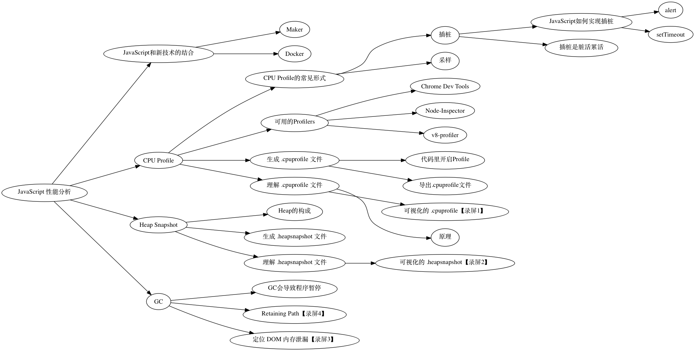

# 《JavaScript 性能分析》

> 《JavaScript 性能分析》课程的相关资料，包括课程大纲，示例代码和讲义

## 难度
中级

## 面向人群
JavaScript 工程师

## 课程简介
本次课程主要介绍了 JavaScript 应用程序性能分析的原理和操作步骤。适合想了解如何分析 JavaScript 应用程序性能的工程师。

## 课程背景介绍：
JavaScript 应用程序分析主要有三种手段 CPU Profile, HeapSnapshot, 和 GC 日志。

## 学习前需掌握的知识：
JavaScript 基础

## 课程大纲：

## 参考资料

《深入浅出 Node.JS》

v8 引擎简介
http://impd.tencent.com/?p=35

Understanding Profiling Methods
https://msdn.microsoft.com/en-us/library/dd264994.aspx

性能分析可视化工具箱
https://github.com/wyvernnot/javascript_performance_measurement

V8 之旅： 垃圾回收器
http://newhtml.net/v8-garbage-collection/

Memory Profiling
https://github.com/thlorenz/v8-perf/blob/master/memory-profiling.md

## 全部资料下载

[zip](https://github.com/wyvernnot/stuq_workshop/zipball/gh-pages)
